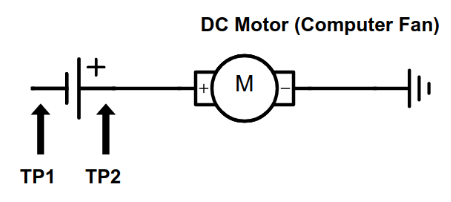
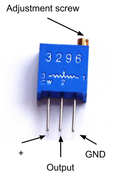

# Electronic Skills 3: Controlling a Fan

In this assignment you will breadboard your salvaged computer fan, learn about trimpots and create a circuit for controlling the speed of the fan.

## Instructions
Make sure your breadboard is set up the following way before building the circuit.

## Circuit 3.1: Breadboarded fan
1. Prepare your salvaged computer fan by identifying which of the wires have to be connected to control the fan. Attach hook up wires to the correct wires.
2. Breadboard the following circuit.
3. Show the circuit to your teacher for marking.  

## Circuit 3.2: Trimpots
Trimpots (also called trimming potentiometers) are small variable resistors. They usually function in conjunction with a knob; the user turns the knob, and this rotational motion is translated into a change in resistance in the electrical circuit. This change in resistance is then used to adjust some aspect of the electrical signal, such as the volume of an audio signal. Pots are employed in all manner of consumer electronics, as well as larger mechanical and electrical equipment.

There are many different types of trimpots, in this assignment you will be using the 3296W multiturn (25 turns) top adjust trimpot (see picture). This trimpot has three terminal, numbered 1, 2 and 3. 
* Terminal 1 is connected to ground (negative power rail).
* Terminal 2 (aka the wiper) is connected to the circuit’s output (e.g. a motor or LED - whatever component that will be controlled by the trimpot).
* Terminal 3 is connected to the positive power rail.

The small screw located on top of the trimpot is used to adjust the resistance. Multiturn potentiometers allow finer adjustments; the resistance changes slowly with each rotation of the screw. In comparison, on a single-turn trimpot the resistance sweeps the entire range from near 0 to full resistance in about 240°. Trimpots are adjusted using tiny screwdrivers. Note that adjusting the trimpot is causing wear on the component as trimpots are only designed for a lifespan of 200 rotational cycles.

Watch the following introduction to trimpots: https://youtu.be/jx3bMDlJkOE 

Start by setting your trimpot to zero resistance using the following procedure:
1. Set your DMM to the resistance setting  (the Ohm symbol).
2. Put the trimpot on a breadboard (same way as in the video).
3. Connect the DMM to terminal 1 (negative probe) and 3 (positive probe) on the trimpot. This will measure the maximum resistance of the trimpot. Make a note of the value you get.
4. Connect the DMM to terminal 1 (negative probe) and 2 (positive probe) on the trimpot. This will measure the currently set resistance value of the trimpot. Make a note of the value you get.
5. Using a small flathead screwdriver turn the adjustment screw while you watch the resistance value on your DMM. Turn the screw until the trimpot is set to 0 Ohms (minimal value).
6. Show your circuit to your teacher for marking.

## Circuit 3.3: Trimpot controlled fan
Breadboard the following circuit. Show the circuit to your teacher for marking.  

!(Circuit 3.3)[images/circuit3.3.png]

